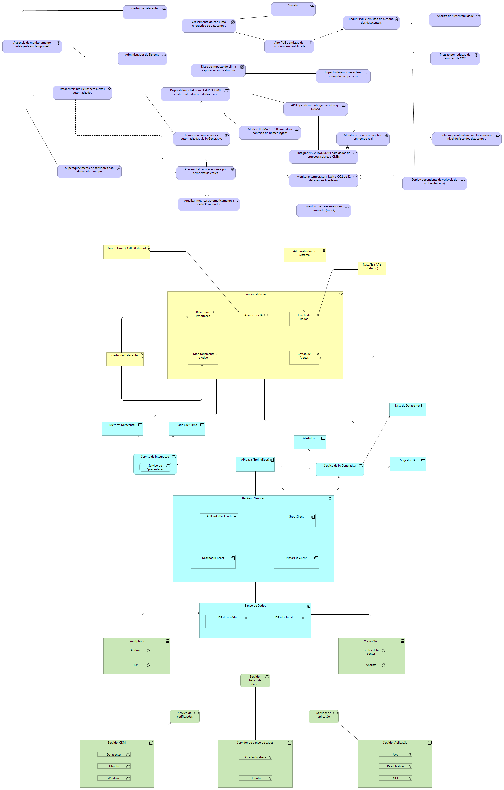

# Orbit X — Plataforma Inteligente para Datacenters Sustentáveis

> Monitoramento inteligente com IA, cloud computing e dados espaciais para datacenters mais eficientes e sustentáveis.

---

## Sobre o Projeto

O **Orbit X** é uma plataforma futurista de monitoramento inteligente desenvolvida para auxiliar datacenters na redução do consumo energético, prevenção de superaquecimento e diminuição da emissão de carbono.

A solução combina **Inteligência Artificial**, **Cloud Computing** e **monitoramento climático e espacial** para gerar análises em tempo real, permitindo que empresas otimizem sua infraestrutura digital de forma sustentável e eficiente.

---

## Problemática

Os datacenters representam uma das maiores demandas energéticas do setor tecnológico. O crescimento acelerado da computação em nuvem, IA e processamento de dados gera desafios críticos:

-  **Alto consumo energético** contínuo dos servidores
-  **Superaquecimento** causando falhas, perda de desempenho e danos físicos
-  **Emissão de carbono** pelos sistemas de refrigeração e processamento
-  **Ausência de plataformas inteligentes** para monitorar e prever falhas de forma automatizada

---

##  Solução

O Orbit X oferece monitoramento contínuo com alertas inteligentes e recomendações automáticas para otimização da infraestrutura, contribuindo diretamente para:

| Benefício | Descrição |
|---|---|
|  Redução de energia | Otimização do consumo energético em tempo real |
|  Prevenção térmica | Antecipação de riscos de superaquecimento |
|  Menor emissão de CO₂ | Redução do impacto ambiental dos datacenters |
|  Otimização de refrigeração | Sugestões automáticas de ajuste de cooling |
|  Eficiência operacional | Gestão estratégica da infraestrutura digital |

---

## Diagrama da Solução

---

## Funcionalidades

### 1.1 Monitoramento Inteligente
Monitoramento contínuo com dashboards modernos e gráficos interativos exibindo:
- Consumo energético
- Temperatura dos servidores
- Eficiência energética
- Emissão de carbono
- Status operacional

### 1.2 Sistema de Previsão Térmica com IA
Análise preditiva de padrões térmicos e operacionais para antecipar riscos:
- Alertas preventivos automáticos
- Recomendações de otimização de refrigeração
- Análises preditivas inteligentes

### 1.3 Monitoramento via Satélite
Dados climáticos e espaciais para análise de condições ambientais globais:
- Mapa global interativo
- Heatmaps térmicos
- Monitoramento climático por região
- Integração com tecnologia orbital

### 1.4 Dashboard em Tempo Real
Central futurista de monitoramento com:
- KPIs inteligentes
- Gráficos animados
- Indicadores de desempenho
- Alertas críticos em tempo real

### 1.5 Relatórios Sustentáveis e ESG
Relatórios automáticos de sustentabilidade e eficiência operacional:
- Economia de energia acumulada
- Redução de carbono
- Comparação de desempenho histórico
- Score sustentável e indicadores ESG

### 1.6 Assistente Inteligente com IA
Chatbot integrado para suporte automatizado e atendimento ao usuário.

---

## Diferenciais

-  **IA preditiva** — previne problemas antes que aconteçam
-  **Integração espacial e satelital** — dados ambientais em escala global
-  **Dashboard futurista** — interface premium estilo SaaS corporativo
-  **Relatórios ESG** — métricas de sustentabilidade prontas para auditoria
-  **Cloud-native** — arquitetura escalável e moderna

---

## Integrantes:

| Nome | RM |
|---|---|
| Gabriel | RM-560210 |
| Renato Kenji Sugaki | RM-559810 |
| Fabio Henrique Eduardo | RM-560416 |
| Lucas Aurelio Chicote | RM-559366 |

---
